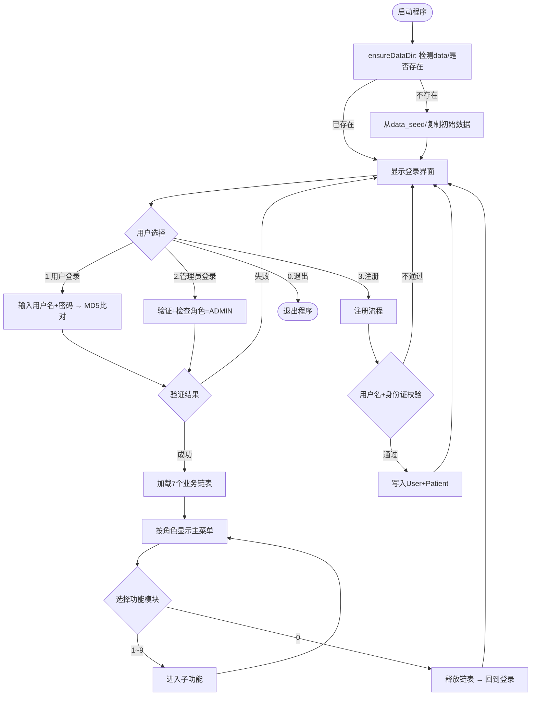
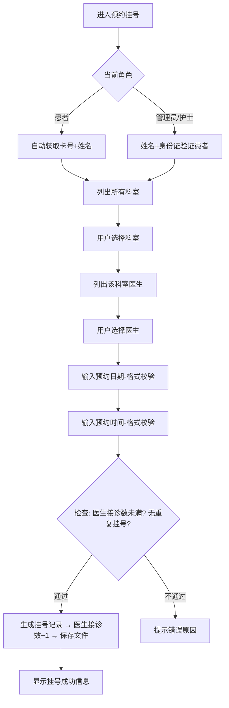
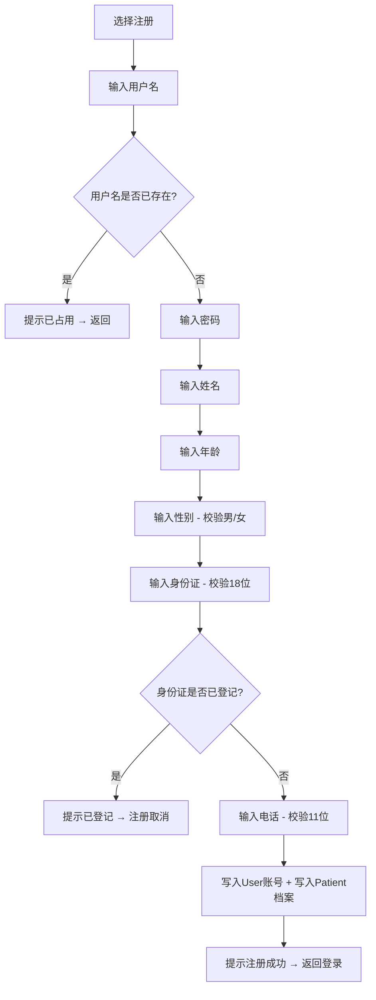
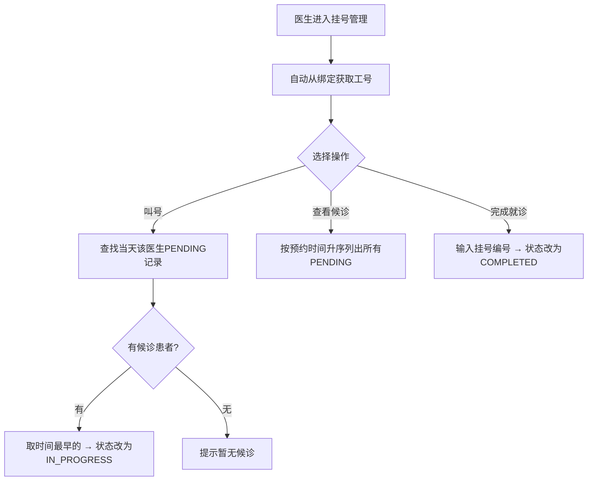

# 报告正文

## 一、系统概述

### 1.1 项目背景与目标

本系统是一个基于 C 语言开发的**小型医院综合信息管理平台**，作为程序设计基础课程设计项目完成。系统模拟真实医院的日常运营流程，旨在解决以下问题：

- 传统手工管理模式下，患者信息、挂号记录、床位状态等数据分散，查询效率低
- 不同岗位人员（医生、护士、管理员）缺乏统一的信息协作平台
- 数据无法持久化保存，重启后丢失

**系统目标**：

1. 实现患者、医生、护士、管理员四种角色的分权协同管理
2. 覆盖挂号预约、患者档案、医生管理、床位管理、药品管理、住院管理六大核心业务
3. 提供统计报表与综合查询功能，辅助管理决策
4. 数据以文件形式持久化存储，支持通过 Git 在多终端间同步

### 1.2 系统架构

系统采用**三层架构**设计：

```
┌─────────────────────────────────────────────────┐
│                 用户交互层（UI）                   │
│   控制台界面 · 菜单导航 · 输入校验 · 权限分流      │
├─────────────────────────────────────────────────┤
│                 业务逻辑层（BLL）                  │
│  login · patient · doctor · registration         │
│  medicine · hospitalization · bed · utils         │
├─────────────────────────────────────────────────┤
│                 数据持久层（DAL）                  │
│   file_io · 文本文件读写 · 链表↔文件双向同步       │
├─────────────────────────────────────────────────┤
│                 数据存储（data/）                  │
│  patient.txt · doctor.txt · registration.txt     │
│  medicine.txt · bed.txt · hospitalization.txt    │
│  user.txt · purchase.txt                         │
└─────────────────────────────────────────────────┘
```

**各层职责**：

| 层次 | 职责 | 对应文件 |
|---|---|---|
| 用户交互层 | 菜单显示、用户输入、格式校验、角色权限控制 | ui.c |
| 业务逻辑层 | 增删改查业务规则、数据校验、链表操作 | patient.c, doctor.c, registration.c, medicine.c, hospitalization.c, bed.c, login.c, utils.c |
| 数据持久层 | 文件读写、链表与文件的序列化/反序列化 | file_io.c |
| 数据存储 | 8 个文本文件，每个对应一类业务数据 | data/*.txt |

### 1.3 功能模块概览

| 模块 | 功能描述 |
|---|---|
| **挂号管理** | 预约挂号、现场挂号、取消挂号、叫号就诊、候诊队列管理、就诊完成 |
| **患者信息管理** | 患者档案的增删改查，患者自助查看/修改个人信息，修改密码 |
| **床位管理** | 床位增删、按科室查询、空闲床位查找、科室统计、自动分配 |
| **医生信息管理** | 医生档案增删改查、按科室/姓名/工号查找、账号绑定 |
| **药品管理** | 药品信息查询、库存补充、购药登记、库存预警检查 |
| **住院管理** | 入院登记、出院结算、住院记录查询、预交金追加、转床 |
| **统计报表** | 病人统计、医生统计、药品统计、住院与床位统计、挂号统计、财务统计 |
| **综合查询** | 按患者/医生/日期/科室等多维度交叉查询关联记录 |
| **用户管理** | 查看所有用户、修改角色、重置密码、删除用户（管理员专用） |

### 1.4 用户角色与权限

| 角色 | 权限范围 | 典型操作 |
|---|---|---|
| **患者** | 仅限个人相关操作 | 预约/取消/查看挂号、查看/修改自己档案、改密码 |
| **护士** | 患者 + 业务管理 | 现场挂号、患者档案管理、床位管理、药品管理、住院管理 |
| **医生** | 患者 + 只读业务 + 就诊 | 叫号、查看候诊、完成就诊、只读查看患者/床位/药品/住院信息 |
| **管理员** | 全部功能 | 以上所有 + 医生管理、统计报表、综合查询、用户管理 |

### 1.5 技术选型

| 项目 | 选择 | 说明 |
|---|---|---|
| 编程语言 | C（C99 标准） | 课程要求，底层控制能力强 |
| 构建工具 | CMake + Ninja | 跨 IDE 兼容，支持 VS2022 |
| 编译器 | MSVC（Visual Studio 2022） | Windows 原生，调试方便 |
| 数据结构 | 双向链表 | 支持高效插入/删除/遍历 |
| 数据存储 | 文本文件（自定义格式） | 可读性好，便于调试和版本管理 |
| 字符编码 | UTF-8 | 支持中文显示，跨平台兼容 |
| 版本管理 | Git + GitHub | 多人协作，多终端数据同步 |
| 运行环境 | Windows 控制台 | SetConsoleOutputCP(65001) 启用 UTF-8 |

---

## 二、一些约定

### 2.1 数据对象定义

系统的功能基于以下核心数据对象实现，每个对象对应一个双向链表和一个持久化文本文件。

| 对象 | 数据文件 | 说明 |
|------|---------|------|
| 患者（Patient） | patient.txt | 门诊卡号、姓名、年龄、性别、身份证、电话、所属账号、住院状态 |
| 医生（Doctor） | doctor.txt | 工号、姓名、科室、每日最大接诊数、今日已接诊数、绑定账号 |
| 挂号（Registration） | registration.txt | 挂号编号、患者卡号/姓名、医生工号/姓名、科室、日期、时间、预约日期/时间、状态、创建者、费用、备注 |
| 药品（Medicine） | medicine.txt | 药品编号、通用名、商品名、规格、单价、库存、最低库存 |
| 购药记录（Purchase） | purchase.txt | 购药编号、患者卡号、药品编号、数量、总费用、日期 |
| 住院（Hospitalization） | hospitalization.txt | 住院编号、患者卡号/姓名、床位号、预交金、总费用、入院日期、状态 |
| 床位（Bed） | bed.txt | 科室、床位号、患者卡号/姓名、状态 |
| 用户（User） | user.txt | 用户名、密码（MD5哈希）、角色、最后登录时间 |

### 2.2 编码与环境约定

- 系统编译环境：Visual Studio 2022，操作系统 Windows 11
- 编程语言：C（C99 标准）
- 构建工具：CMake 3.10+ / Ninja 生成器
- 汉字编码：UTF-8（源文件 `/utf-8` 编译选项，控制台 `SetConsoleOutputCP(65001)`）
- 数据文件编码：UTF-8 无 BOM

### 2.3 命名规范

| 类别 | 规则 | 示例 |
|------|------|------|
| 链表加载 | `buildXxxChain` | `buildPatientChain(Patient** head, Patient** tail)` |
| 链表写回 | `rebuildXxxFile` | `rebuildPatientFile(Patient* head)` |
| 添加节点 | `addXxx` | `addPatient(...)` |
| 删除节点 | `delXxx` | `delPatient(...)` |
| 按字段查找 | `findXxxByXxx` | `findPatientByCardNo(...)` |
| 列表显示 | `listAllXxx` | `listAllPatients(Patient* head)` |
| 释放链表 | `freeXxxChain` | `freePatientChain(Patient** head)` |
| 全局变量 | `g_` 前缀 | `g_patientHead`, `g_currentUsername` |

### 2.4 文件存储格式约定

每个数据文件采用统一格式：
- 每条记录以 `1` 开头（表示有效记录）
- 各字段逐行存储，每行一个字段
- 记录之间以空行分隔
- 文件末尾以 `-1` 标记结束

```
1
字段1
字段2
...
字段N

1
字段1
...

-1
```

### 2.5 数据管理约定

- `data_seed/` 目录存放初始种子数据，随 Git 仓库提交
- `data/` 目录为运行时数据，加入 `.gitignore` 不纳入版本管理
- 程序首次运行时自动从 `data_seed/` 复制到 `data/`
- 重置数据：删除 `data/` 目录，下次运行自动恢复

### 2.6 Git 协作约定

- 主分支：`main`
- 提交信息格式：`type(module): 具体改动`
- 不直接 push 到 main，通过 Pull Request 合并
- `data/`、`.vs/`、`out/`、`*.exe` 等不纳入版本管理

---

## 三、具体功能实现

### 3.1 用户登录与注册模块

**登录功能**：
- 用户输入用户名和密码，系统将密码进行 MD5 哈希后与文件中存储的哈希值比对
- 匹配成功后记录当前用户名、角色，设置登录状态
- 管理员登录入口额外检查角色是否为 ADMIN，非管理员账号会被拒绝

**注册功能**：
- 采用"先校验后写入"策略，避免产生孤儿账号
- 流程：输入用户名（检查重名）→ 输入密码 → 录入病人档案（姓名/年龄/性别/身份证/电话）→ 检查身份证唯一性 → 全部通过后同时写入 User 和 Patient
- 注册时自动将 `ownerUsername` 绑定为注册用户名

**密码修改**（患者）：
- 验证旧密码 → 输入新密码 → 确认新密码 → 两次一致才写入

### 3.2 挂号管理模块

**预约挂号**：
- 患者登录后自动获取卡号（无需手动输入）
- 先选科室 → 再选该科室医生 → 输入预约日期（YYYY-MM-DD 格式校验）→ 输入预约时间（HH:MM 格式校验）
- 系统检查医生当日接诊数是否已满、是否重复挂号
- 成功后医生接诊数 +1，生成唯一挂号编号

**现场挂号**（护士/管理员）：
- 通过姓名+身份证验证患者身份
- 日期和时间自动取当前值

**取消挂号**：
- 患者自动列出自己的待就诊挂号，选择序号取消
- 护士/管理员通过姓名+身份证查找患者后操作

**医生叫号/候诊/完成就诊**：
- 医生登录后自动从账号绑定获取工号，无需手动输入
- 候诊队列按预约时间升序排列

### 3.3 患者信息管理模块

**权限分流**：
- 患者视角：只能查看/修改自己的档案、修改密码
- 医生视角：只读查看（按姓名+身份证查找、模糊查找、显示全部）
- 护士/管理员视角：完整增删改查

**身份验证**：
- 所有需要定位患者的操作（删除/修改/购药/住院等）统一使用"姓名+身份证"验证，替代原来的卡号输入

### 3.4 床位管理模块

**床位号格式**：`科室名-序号`（如 `内科-01`、`外科-03`）
- 添加床位时输入科室名，系统自动统计该科室已有床位数并生成下一个序号

**功能**：
- 添加/删除床位（护士/管理员）
- 按科室查询（列出科室列表供选择）
- 查找空闲床位（返回所有空闲床位列表）
- 科室统计（总床位/已占用/空闲）
- 入院时自动分配空闲床位，出院时自动释放

### 3.5 医生信息管理模块

**账号绑定机制**：
- DoctorData 包含 `ownerUsername` 字段
- 管理员添加医生时可指定绑定用户名（或输"无"暂不绑定）
- 修改医生时可补绑/清除绑定
- 医生登录后系统通过绑定关系自动识别身份

**查找功能**：
- 按工号精确查找
- 按姓名模糊查找（返回所有匹配，支持同名）
- 按科室查找（返回该科室所有医生）

### 3.6 药品管理模块

- 按编号/名称查询药品信息
- 补充库存
- 购药登记（扣减库存、记录购药流水）
- 库存预警检查（列出低于最低库存的药品）
- 医生视角为只读（仅查询）

### 3.7 住院管理模块

- 入院登记：通过姓名+身份证验证患者 → 自动分配床位 → 输入预交金
- 出院结算：计算总费用与预交金差额，多退少补
- 按卡号/住院单号查询
- 追加预交金
- 修改住院信息（转床/追加押金）
- 医生视角为只读

### 3.8 统计报表模块

- 病人统计：总人数、住院/非住院分布
- 医生统计：按科室分组统计人数
- 药品统计：库存总览、预警药品
- 住院与床位统计：在院人数、床位使用率
- 挂号统计：各状态分布、按日期统计
- 财务统计：挂号收入、药品收入、住院收入

### 3.9 综合查询模块

- 按姓名+身份证查全部关联记录（患者信息+挂号+住院+购药）
- 按医生查其挂号记录
- 按日期查挂号记录
- 按日期查住院记录
- 按科室查医生和病人
- 药品库存明细查询

### 3.10 用户管理模块（管理员专用）

- 查看所有用户（用户名/角色/最后登录时间）
- 修改用户角色（患者/护士/医生/管理员）
- 重置用户密码（统一重置为 123456）
- 删除用户（不能删除当前登录账号，需二次确认）

---

## 四、流程图

### 4.1 系统总体流程



### 4.2 挂号预约流程



### 4.3 患者注册流程



### 4.4 医生就诊流程



---

## 五、运行界面截图指南

请按以下顺序截图，每张截图标注编号和说明：

### 5.1 登录与注册

| 编号 | 操作 | 截图内容 |
|------|------|---------|
| 5.1.1 | 启动程序 | 登录界面（显示4个选项） |
| 5.1.2 | 用户注册 | 输入用户名/密码/档案信息的完整过程 |
| 5.1.3 | 注册失败 | 用户名重复或身份证重复的报错 |
| 5.1.4 | 用户登录 | 输入正确账号密码后进入主菜单 |
| 5.1.5 | 管理员登录 | 管理员主菜单（9项） |
| 5.1.6 | 非管理员误入 | 普通账号走管理员入口被拒绝 |

### 5.2 患者功能

| 编号 | 操作 | 截图内容 |
|------|------|---------|
| 5.2.1 | 患者主菜单 | 显示挂号管理+患者信息管理 |
| 5.2.2 | 查看我的档案 | 显示个人信息表格 |
| 5.2.3 | 修改档案 | 修改后显示更新结果 |
| 5.2.4 | 修改密码 | 旧密码验证+新密码确认 |
| 5.2.5 | 预约挂号 | 选科室→选医生→输日期时间→成功 |
| 5.2.6 | 查看我的挂号 | 挂号记录列表 |
| 5.2.7 | 取消挂号 | 选择待就诊记录取消 |

### 5.3 医生功能

| 编号 | 操作 | 截图内容 |
|------|------|---------|
| 5.3.1 | 医生主菜单 | 显示1-5项 |
| 5.3.2 | 查看候诊列表 | 自动识别身份，显示候诊队列 |
| 5.3.3 | 叫号 | 叫下一位患者 |
| 5.3.4 | 完成就诊 | 标记挂号为已完成 |
| 5.3.5 | 只读查看患者 | 医生视角的患者信息（无增删改） |

### 5.4 护士/管理员功能

| 编号 | 操作 | 截图内容 |
|------|------|---------|
| 5.4.1 | 患者管理 | 添加/删除/修改/查找病人 |
| 5.4.2 | 床位管理 | 添加床位（科室-序号格式）、按科室查询 |
| 5.4.3 | 药品管理 | 查询/补库存/购药登记 |
| 5.4.4 | 住院管理 | 入院登记/出院结算 |
| 5.4.5 | 医生管理 | 添加医生（含绑定用户名） |
| 5.4.6 | 统计报表 | 任选2-3个统计项展示 |
| 5.4.7 | 综合查询 | 按患者查全部关联记录 |
| 5.4.8 | 用户管理 | 查看用户列表/修改角色/重置密码 |

---

## 六、测试样例与结果

### 6.1 正常功能测试

| 测试编号 | 测试场景 | 输入 | 预期结果 | 实际结果 |
|---------|---------|------|---------|---------|
| T01 | 注册新用户 | 用户名:test 密码:123456 姓名:测试 年龄:25 性别:男 身份证:110101200001011234 电话:13800138000 | 注册成功，返回登录界面 | （截图） |
| T02 | 重复用户名注册 | 用户名:test（已存在） | 提示"用户名已被占用" | （截图） |
| T03 | 重复身份证注册 | 身份证:110101200001011234（已存在） | 提示"该身份证已登记档案" | （截图） |
| T04 | 患者预约挂号 | 选内科→选张伟→日期2026-05-15→时间09:30 | 挂号成功，显示编号 | （截图） |
| T05 | 医生查看候诊 | 张伟登录→查看候诊列表 | 显示刚才的挂号记录 | （截图） |
| T06 | 医生叫号 | 张伟→叫号 | 状态变为就诊中 | （截图） |
| T07 | 完成就诊 | 输入挂号编号 | 状态变为已完成 | （截图） |
| T08 | 添加床位 | 科室:内科 | 生成"内科-06"（已有5张） | （截图） |
| T09 | 删除操作确认 | 删除病人→输入y | 删除成功 | （截图） |
| T10 | 删除操作取消 | 删除病人→输入N | 提示"已取消" | （截图） |

### 6.2 边界与异常测试

| 测试编号 | 测试场景 | 输入 | 预期结果 | 实际结果 |
|---------|---------|------|---------|---------|
| T11 | 性别输入错误 | "不男不女" | 提示"请输入 男 或 女"，要求重输 | （截图） |
| T12 | 身份证格式错误 | "123"（不足18位） | 提示格式不正确，要求重输 | （截图） |
| T13 | 电话格式错误 | "abc" | 提示格式不正确，要求重输 | （截图） |
| T14 | 时间格式错误 | "26:32" | 提示格式不正确，要求重输 | （截图） |
| T15 | 日期格式错误 | "2026-5-14"（缺前导零） | 提示格式不正确，要求重输 | （截图） |
| T16 | 数字输入字母 | 菜单选择输入"abc" | 提示"输入无效，请输入数字" | （截图） |
| T17 | 超范围数字 | 菜单最大9，输入15 | 提示"请输入0~9之间的数字" | （截图） |
| T18 | 非管理员走管理员入口 | 普通用户选2登录 | 提示"此账号不是管理员" | （截图） |
| T19 | 删除自己的账号 | 管理员删除当前登录账号 | 提示"不能删除当前登录的账号" | （截图） |
| T20 | 空文件启动 | 删除data/后启动 | 自动从data_seed复制，正常运行 | （截图） |

---

## 七、防止错误的措施与效果

### 7.1 输入安全

| 措施 | 实现方式 | 防止的问题 |
|------|---------|-----------|
| **动态格式串** | `safeReadString` 使用 `sprintf(fmt, "%%%ds", maxLen-1)` 生成格式串 | 栈缓冲区溢出（原 `scanf("%99s", buf)` 对小 buffer 会溢出） |
| **输入缓冲清理** | `flushStdin()` 带 EOF 保护：`while((c=getchar())!='\n'&&c!=EOF)` | 多余输入串台到下一步、EOF 死循环 |
| **格式校验循环** | `readGender`/`readIdCard`/`readPhone`/`readTime`/`readDate` 封装 while 循环 | 非法输入直接进入业务逻辑导致数据污染 |
| **数字范围校验** | `safeReadInt(prompt, min, max)` 内置范围检查 | 越界选择触发未定义行为 |

### 7.2 数据完整性

| 措施 | 实现方式 | 防止的问题 |
|------|---------|-----------|
| **身份证唯一性检查** | 注册和添加病人时调用 `findPatientByIdCard` | 同一人重复建档 |
| **用户名唯一性检查** | 注册时调用 `isUsernameTaken` | 账号冲突 |
| **注册原子性** | 先校验全部字段，最后才写入 User 和 Patient | 校验失败时不产生孤儿账号 |
| **注册前加载链表** | case 3 开头 `buildPatientChain` | 空链表覆盖已有数据 |
| **memset 初始化** | `registerUser` 中 `memset(&newUser->data, 0, sizeof(UserData))` | MSVC debug 模式 0xCD 垃圾字节写入文件 |

### 7.3 权限控制

| 措施 | 实现方式 | 防止的问题 |
|------|---------|-----------|
| **角色分级菜单** | `showMainMenuByRole` 按 userRole 显示不同项 + maxOption 限制 | 低权限用户访问高权限功能 |
| **子菜单分流** | 各 show*Management 函数入口按角色进入不同分支 | 医生误操作增删改 |
| **管理员入口验证** | case 2 登录成功后检查 `role == ADMIN` | 普通用户通过管理员入口越权 |
| **删除自己保护** | 用户管理删除时检查 `username != g_currentUsername` | 管理员误删自己导致无法登录 |
| **二次确认** | `confirmYesNo("确认删除？")` 默认 N | 误操作删除数据 |

### 7.4 文件与内存安全

| 措施 | 实现方式 | 防止的问题 |
|------|---------|-----------|
| **fscanf 返回值检查** | `while(fscanf(fp,"%d",&opt)==1)` | 空文件/EOF 导致无限循环 |
| **UTF-8 BOM 规避** | 数据文件统一用无 BOM 的 UTF-8 写入 | BOM 字节导致首次 fscanf 失败 |
| **data_seed 机制** | 种子数据与运行时数据分离 | 测试数据污染版本库、换电脑数据丢失 |
| **登录后加载/退出时释放** | main 循环中 build/free 配对 | 内存泄漏 |
| **remarks 空串保护** | 写入时 `remarks[0] ? remarks : "无"` | fscanf %s 读空串导致字段错位 |

### 7.5 显示对齐

| 措施 | 实现方式 | 防止的问题 |
|------|---------|-----------|
| **printPadded 函数** | 按 UTF-8 字符显示宽度（ASCII=1格，中文=2格）补空格 | 中英文混排表格错位 |
| **strDisplayWidth** | 逐字节判断 UTF-8 编码长度，累加显示宽度 | printf %-Ns 按字节对齐导致列不齐 |

---

## 八、总结与展望

### 8.1 项目总结

本项目从零开始，完成了一个功能较为完整的医院综合信息管理系统。通过本次课程设计，主要收获如下：

**技术层面**：
- 深入理解了 C 语言双向链表的设计与实现，掌握了动态内存管理（malloc/free 配对、防泄漏）
- 实践了"文件 ↔ 链表"双向序列化的数据持久化方案
- 掌握了多模块协作开发中的接口设计、头文件组织、命名规范
- 理解了 UTF-8 编码在 Windows 控制台下的处理方式（BOM 问题、中英文对齐）
- 学会了使用 CMake 构建系统和 Git 版本管理进行团队协作

**工程层面**：
- 体会到"先设计后编码"的重要性——数据结构和接口约定清晰后，各模块可以并行开发
- 认识到输入校验的必要性——用户输入不可信，必须在系统边界做严格检查
- 理解了权限分级的设计思路——同一功能对不同角色展示不同视图
- 实践了"种子数据 + 运行时数据"分离的数据管理策略

### 8.2 已知局限

| 局限 | 说明 |
|------|------|
| 控制台界面 | 无图形化界面，操作依赖键盘输入，用户体验有限 |
| 单机运行 | 不支持网络访问，无法多终端同时在线 |
| 文本存储 | 数据量大时读写效率低，无索引机制 |
| 密码安全 | MD5 哈希已不安全（仅作演示），无加盐处理 |
| 并发安全 | 无文件锁机制，多进程同时写入可能数据损坏 |

### 8.3 未来展望

如果继续完善本系统，可以从以下方向改进：

1. **图形化界面**：使用 StellarX 框架或 Qt 实现窗口化操作界面
2. **数据库存储**：将文本文件替换为 SQLite，提升查询效率和数据安全性
3. **网络化**：引入 C/S 架构，支持多终端同时访问
4. **安全增强**：密码加盐哈希（bcrypt）、登录失败锁定、操作日志审计
5. **业务扩展**：处方管理、检查检验、费用明细、排班管理等
